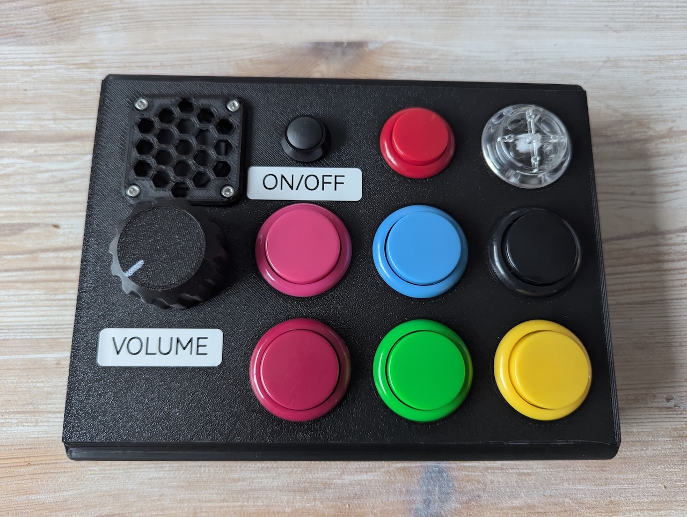

## Baby's First Beats

Sample box for a very small child, to introduce them to DnB/Garage/Jungle etc

### Hardware
- [Adafruit RP2040 Prop-Maker Feather](https://learn.adafruit.com/adafruit-rp2040-prop-maker-feather)
    - Modified to remove 10K pullup on EN pin
- [Mini speaker 4R 3W](https://shop.pimoroni.com/products/mini-speaker-4-3w)
- [2200mAh LiPo battery pack](https://shop.pimoroni.com/products/lithium-ion-battery-pack?variant=23417820359)
- [Colourful Arcade Buttons](https://shop.pimoroni.com/products/colourful-arcade-buttons?variant=451785353)
- 3D Printed Case, see /cad
- [Adafruit Micro SD SPI or SDIO Card Breakout Board - 3V ONLY!](https://www.adafruit.com/product/4682)
- [Adafruit Push Button Power Switch Breakout](https://www.adafruit.com/product/1400) Drives EN pin high to latch power on

### Code
- Runs on CircuitPython 9.0
- Hardware test project in `code/hw_test` 
- Actual code in `code/app`
    - Make sure to manually copy the contents of SD to your SD card with a proper card reader, you can't write to them over the CircuitPython USB interface

### Samples
- Samples from ross
- Loops: 
    - Diesel not Petrol - Sukh Night
    - [Wu Tang - Protect Ya Neck (Drum Loop) 103 BPM by Krem Drums](https://www.youtube.com/watch?v=_KVcPm7FgkQ)
    - The Next Episode (Instrumental) - Dr Dre

### Credits
- Many Adafruit models from [Adafruit CAD Parts](https://github.com/adafruit/Adafruit_CAD_Parts)

### TODO
- Read battery with external resistor divider